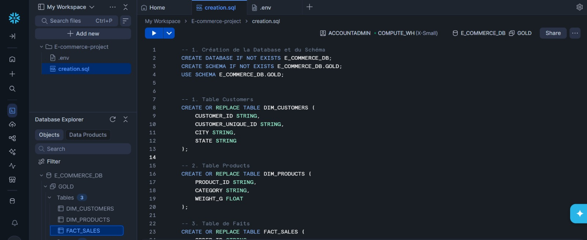
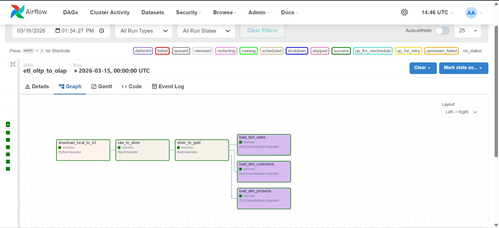
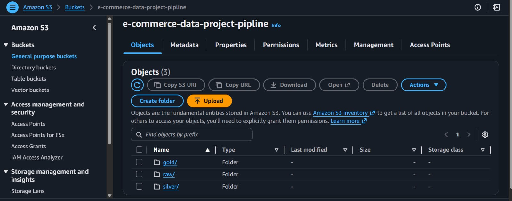
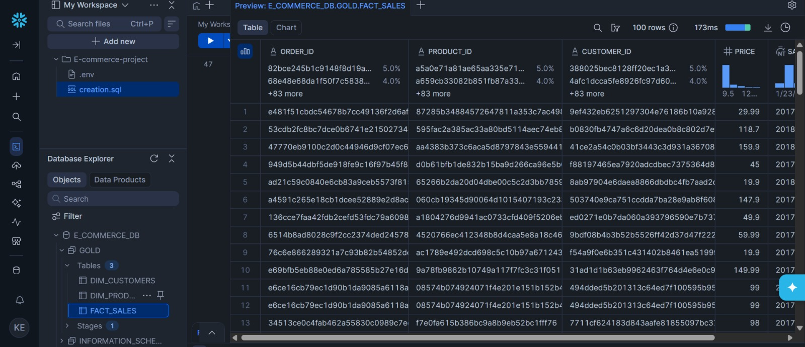

# E-Commerce Data Pipeline


-purple.svg)

### Medallion Architecture with Airflow, Spark, AWS S3, and Snowflake

---

## 📌 Project Overview

This project implements a complete Data Engineering pipeline to collect, transform, and load e-commerce data for decision-making analytics.

The main goal is to transform OLTP (Online Transaction Processing) transactional data into an OLAP (Online Analytical Processing) data warehouse optimized for Business Intelligence and reporting.

The architecture is based on:

- a Medallion architecture (Bronze / Silver / Gold),
- Apache Spark for data processing,
- Amazon S3 as the Data Lake,
- Apache Airflow for orchestration,
- Snowflake as the final Data Warehouse.

---

## 📊 Initial Dataset

### Source

The data comes from the public Olist Brazilian E-Commerce Public Dataset, available on Kaggle:

https://www.kaggle.com/datasets/olistbr/brazilian-ecommerce

### Key Characteristics

- more than 100,000 orders,
- period covered: 2016 to 2018,
- anonymized data,
- 9 relational tables.

### Files Included in the Project

- olist_customers_dataset.csv
- olist_geolocation_dataset.csv
- olist_order_items_dataset.csv
- olist_order_payments_dataset.csv
- olist_order_reviews_dataset.csv
- olist_orders_dataset.csv
- olist_products_dataset.csv
- olist_sellers_dataset.csv
- product_category_name_translation.csv

The source files are stored in the `dags/data` folder after running the file : **upload_data.py**.

### Data Used by the Current Pipeline

The current implementation mainly uses:

- olist_customers_dataset.csv
- olist_orders_dataset.csv
- olist_order_items_dataset.csv
- olist_products_dataset.csv

---

## 🏗️ Pipeline Architecture

### 🥉 Raw Layer

- Ingestion of local CSV files into S3 (prefix `raw/`).
- Data is kept in its original format.

### 🥈 Silver Layer

Technical transformations with Spark (script `spark_job1.py`):

- duplicate removal,
- missing value handling,
- type conversion (for example, timestamp),
- writing cleaned data to S3 (prefix `silver/`).

### 🥇 Gold Layer

Business transformations with Spark (script `spark_job2.py`):

- creation of `DIM_CUSTOMERS`,
- creation of `DIM_PRODUCTS`,
- creation of `FACT_SALES` (join between orders and order_items),
- export of tables as CSV files to S3 (prefix `gold/`).

### ❄️ Snowflake Loading

Automatic loading from S3 to Snowflake using `COPY INTO` commands executed by Airflow.

---

## 🔄 Orchestration with Airflow

Main DAG: `etl`

Task execution order:

1. `download_local_to_s3`
2. `raw_to_silver`
3. `silver_to_gold`
4. `load_dim_customers`, `load_dim_products`, `load_fact_sales`

---

## ☁️ S3 Storage

Logical organization of data in the bucket:

```text
s3://e-commerce-data-project-pipline/
├── raw/
├── silver/
└── gold/
```

---

## 🛠️ Technologies Used

Apache Airflow : Pipeline orchestration

Apache Spark (PySpark) : Data processing and transformation

Amazon S3 : Data Lake storage

Snowflake : Data Warehouse

Docker : Containerization

---

## 🚀 Running the Project

### Prerequisites

- Docker installed,
- Docker Compose installed,
- an AWS account with an S3 bucket,
- a Snowflake account.

### Configuration

Configure the connections in Airflow (Admin > Connections):

- `aws_default`: AWS credentials,
- `snowflake_id`: account, user, password, warehouse, database, schema.

### Execution

From the `docker` folder:

```bash
docker compose up --build -d
```

Then open Airflow:

http://localhost:8080

Enable and trigger the `etl` DAG.

---

## ✅ Expected Results

- data available in S3 (`raw`, `silver`, `gold`),
- Snowflake tables populated:
   - `DIM_CUSTOMERS`,
   - `DIM_PRODUCTS`,
   - `FACT_SALES`.


---

## 👩‍💻 Author

Khadija El Merahy  
Student in Information Systems and Big Data Engineering  
ENSA Berrechid
